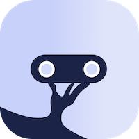

<p align="center">
    <br>    
</p>
<h1 align="center">kellner.team</h1>
<div align="center">
    <span>Lightning fast and simple gastronomy</span><br>
    <a href="https://play.google.com/store/apps/details?id=org.datepollsystems.waiterrobot.android">
        
    </a>
    <a href="https://apps.apple.com/at/app/waiterrobot/id1610157234?itsct=apps_box_badge&itscg=30200">
      
    </a>
    <!-- Add Desktop download image -->
</div>

## Releasing

All the client apps in this repository share the same version and are always released together.
The version is derived entirely from git tags via
the [axion-release](https://github.com/allegro/axion-release-plugin) Gradle plugin — the git tags are the single source
of truth, there is no version hardcoded in any file.

### Production

A release is started **locally** with a Gradle command. This creates an annotated git tag (`major.minor.patch`) and
pushes it to `origin`. Pushing the tag triggers the GitHub Actions that build and publish the individual clients.

```shell
./gradlew release                                        # bump patch (default), e.g. 3.1.1 -> 3.1.2
./gradlew release -Prelease.versionIncrementer=incrementMinor   # 3.1.1 -> 3.2.0
./gradlew release -Prelease.versionIncrementer=incrementMajor   # 3.1.1 -> 4.0.0
./gradlew release -Prelease.version=4.0.0                # release an explicit version
```

To see which version the current working tree would produce without releasing, run `./gradlew currentVersion`.

### Lava (staging/dev)

On each push to the main branch a lava (staging/dev) build is triggered.

- android will be published to the `internal` track of the `lava kellner.team` app
  on [Google Play](https://play.google.com/store/apps/details?id=org.datepollsystems.waiterrobot.android.lava).
- iOS will be published to TestFlight of the kellner.team Lava app.

For access to the development builds of Android and iOS contact `development@kellner.team`.

## Versioning schema

Every client is versioned from git tags via axion-release. Tags are plain semver with **no `v` prefix**
(e.g. `3.1.1`). Two values are produced for the app stores:

- **`versionName`** (the human-readable version shown to users):
    - Release build (working tree sits exactly on a clean tag): `major.minor.patch` (e.g. `3.1.1`)
    - Lava (staging/dev) build, i.e. any build not on a release tag: `major.minor.patch-lava-commitHash`
      (e.g. `3.1.2-lava-a1b2c3d`) — the short commit hash makes the build traceable to an exact commit (e.g. in Sentry).
- **`versionCode`** (the monotonic integer required by Google Play and the App Store): a fixed baseline plus the total
  commit count (`git rev-list --count HEAD`). The baseline (in the root `build.gradle.kts`) lifts every generated code
  above the highest `versionCode` that was already published before versioning moved to git; the commit count keeps it
  strictly increasing on `main` from there.

> Run `./gradlew currentVersion` to get the `versionName` of the current working tree.

The `versionCode` is deterministic — the same commit always produces the same number, with no external build state.
The trade-off is that two builds from the same commit share a `versionCode`, and the stores reject a duplicate. This
only matters when you need to re-upload from the same commit (e.g. a CI re-run after the artifact was already
published, or a re-publish without a source change). When that happens, bump the counter with an empty commit:

```shell
git commit --allow-empty -m "rebump versionCode"
```

## Build and Run

### Android Application

To build and run the development version of the Android app, use the run configuration from the run widget
in your IDE’s toolbar or build it directly from the terminal:

- on macOS/Linux
  ```shell
  ./gradlew :composeApp:assembleDebug
  ```
- on Windows
  ```shell
  .\gradlew.bat :composeApp:assembleDebug
  ```

To also install and launch it in a running emulator use the `:composeApp:installDebug` task.

### iOS Application

To build and run the development version of the iOS app, use the run configuration from the run widget
in your IDE’s toolbar or open the [/iosApp](./iosApp) directory in Xcode and run it from there.

```shell
open iosApp/iosApp.xcodeproj
```

# Kotlin Multiplatform

This is a Kotlin Multiplatform project targeting Android, iOS, Desktop (JVM).

* [/composeApp](./composeApp/src) is for code that will be shared across the Compose Multiplatform applications (
  android & desktop).
  It contains several subfolders:
    - [commonMain](./composeApp/src/commonMain/kotlin) is for code that’s common for all targets.
    - Other folders are for Kotlin code that will be compiled for only the platform indicated in the folder name.
      For example, if you want to edit the Desktop (JVM) specific part, the [jvmMain](./composeApp/src/jvmMain/kotlin)
      folder is the appropriate location for the Android specific part have a look
      at [androidMain](./composeApp/src/androidMain/kotlin).

* [/iosApp](./iosApp/iosApp) contains the iOS application. It's the entrypoint for the iOS app. This is also where the
  UI (SwiftUI) for iOS lives.

* [/shared](./shared/src) is for the code that will be shared between all targets in the project.
  The most important subfolder is [commonMain](./shared/src/commonMain/kotlin). If preferred, you
  can add code to the platform-specific folders here too.

---

Learn more about [Kotlin Multiplatform](https://www.jetbrains.com/help/kotlin-multiplatform-dev/get-started.html)…